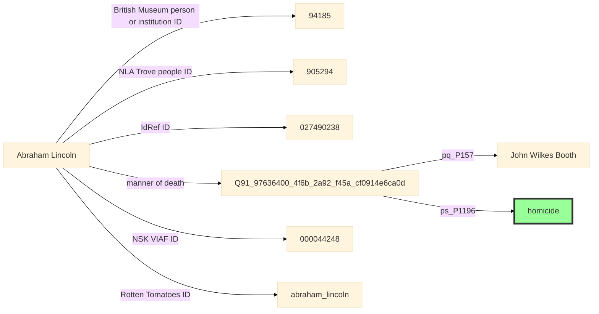
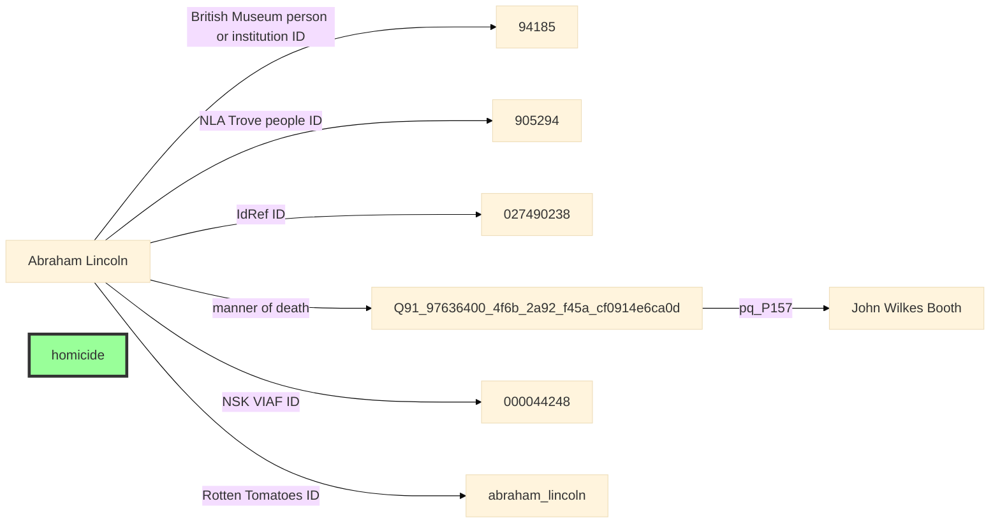
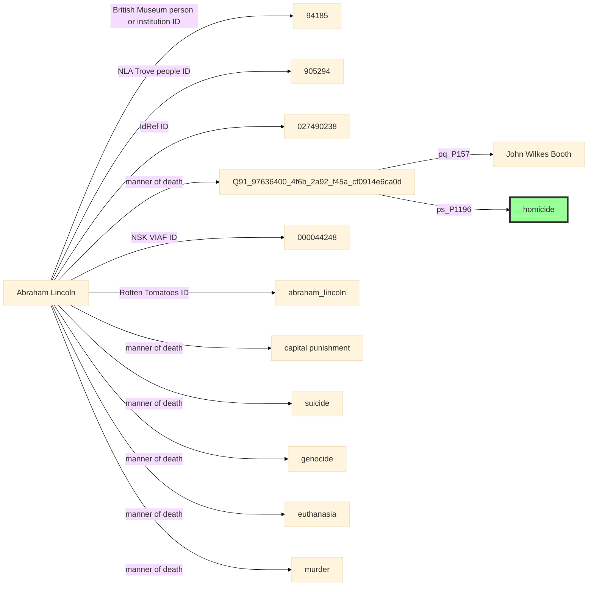
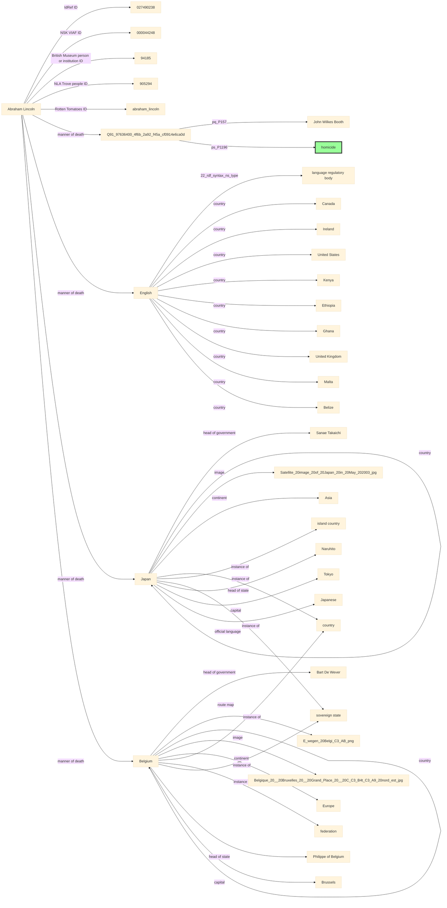
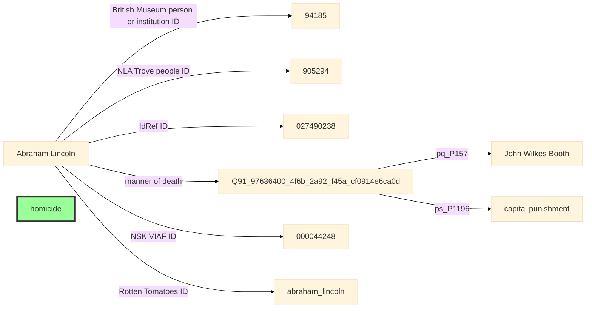

# Trực quan hóa Biểu đồ: `6351`

**Câu hỏi:** How did John Wilkes Booth kill Abraham Lincoln?

**Đáp án đích (tô màu Xanh):**
- `http://www.wikidata.org/entity/Q149086` (homicide)

---

## Bản thể `CLEAN`

## Bản thể `BROKEN`

## Bản thể `TYPE_MATCHING`

## Bản thể `TOPOLOGICAL`

## Bản thể `SWAPPING`

